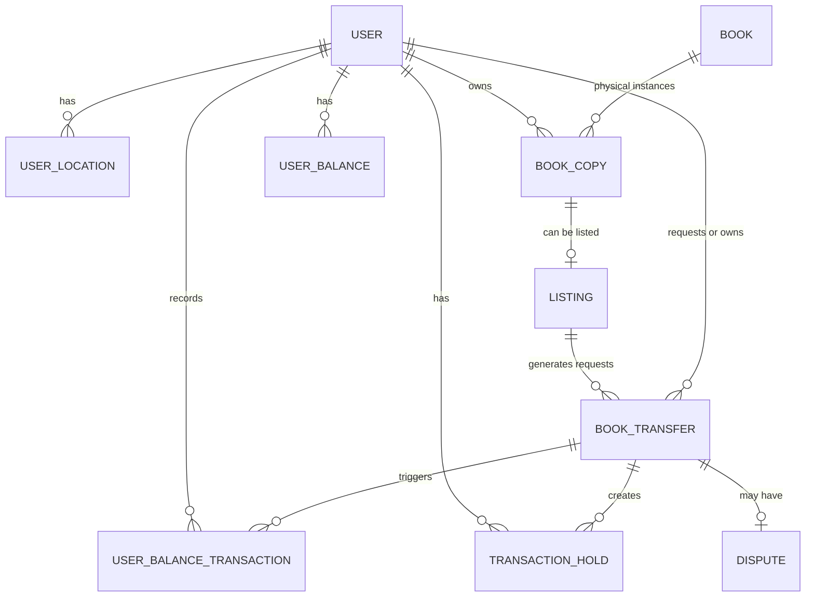
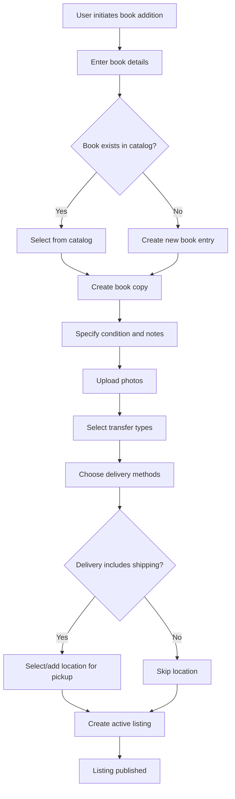
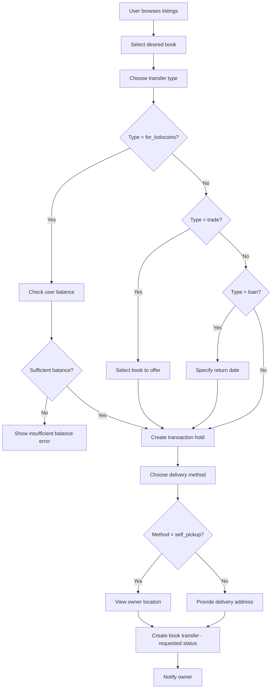
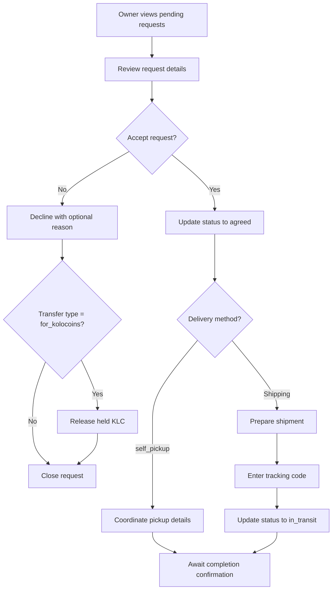
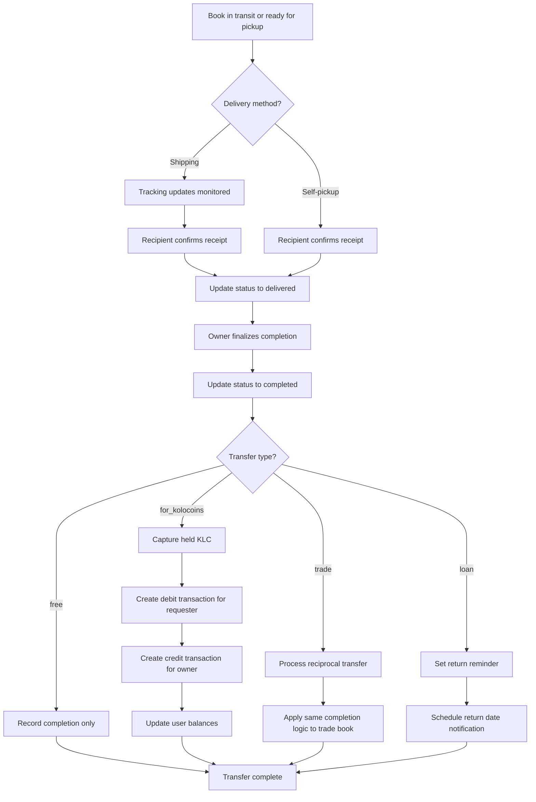
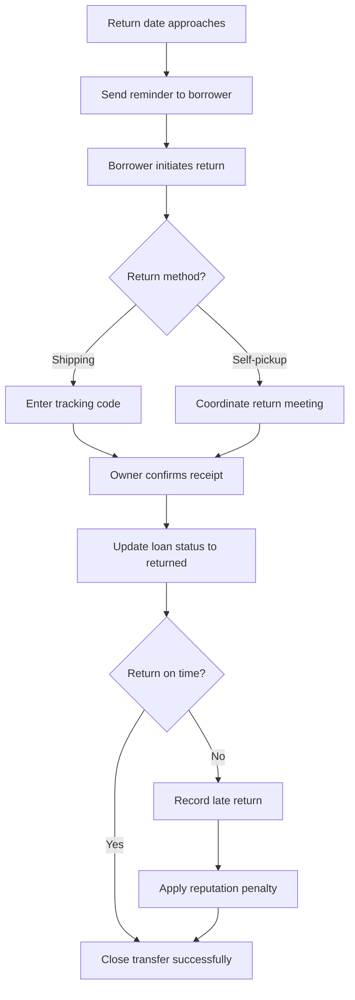
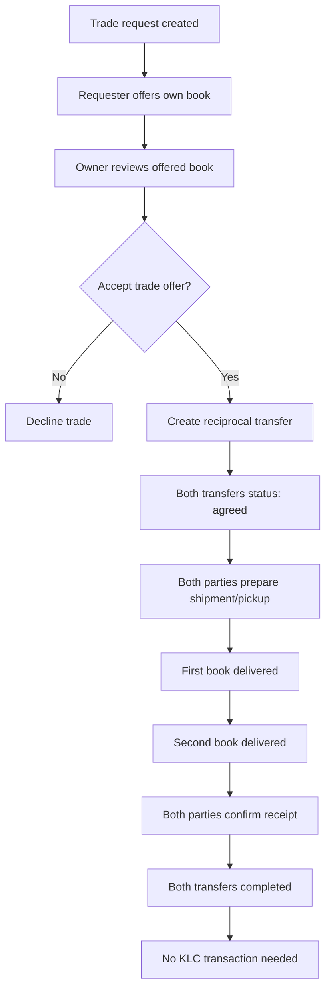
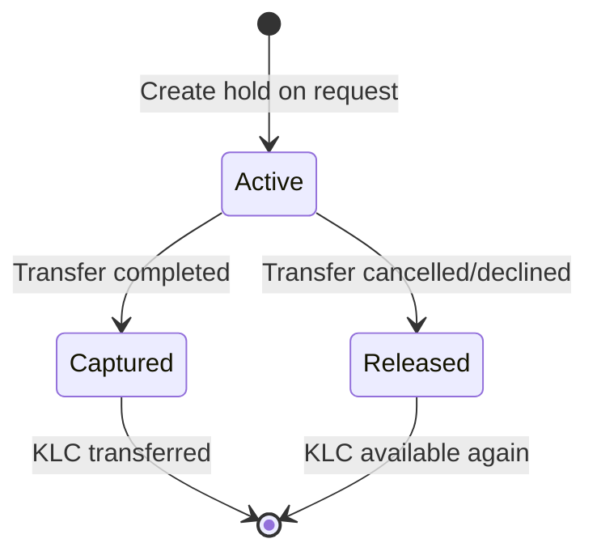
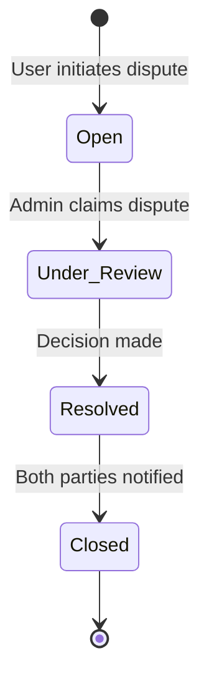

# Kolotebe MVP - Book Sharing Platform Design

## Vision and Objectives

### Product Vision
Kolotebe is a book-sharing platform enabling users to exchange books through multiple mechanisms: free giveaways, virtual currency (Kolocoins - KLC), direct trades, or temporary loans. The platform facilitates peer-to-peer book circulation with built-in economic incentives and flexible delivery options.

### Core Value Proposition
- Encourage book circulation and community building through gamified virtual currency
- Provide flexible exchange mechanisms matching different user preferences
- Support multiple delivery methods accommodating Ukrainian logistics infrastructure
- Build trust through transparent transaction tracking and dispute resolution

### Success Criteria
- Users can successfully list books and complete transactions across all exchange types
- Kolokoin economy maintains integrity with immutable ledger tracking
- Delivery flow supports self-pickup, Nova Poshta, and Ukrposhta
- Dispute resolution mechanism handles conflicts effectively
- Platform prevents fraud through verification and audit systems

## Business Domain Model

### Core Entities

#### User
Represents a platform participant who can own books, create listings, and participate in exchanges.

**Key Attributes:**
- Identity information (name, email, phone)
- Authentication credentials
- Verification status (phone verified)
- Account status and timestamps
- Soft delete support

#### User Location
Represents physical addresses associated with users for delivery purposes.

**Key Attributes:**
- Address components (street, city, postal code, country)
- Location type (home, work, pickup point)
- Default location flag
- Associated user reference

#### Book
Represents a unique book title in the system catalog.

**Key Attributes:**
- Title and author information
- ISBN or unique identifier
- Book metadata (genre, publication year)
- Cover image reference

#### Book Copy
Represents a physical instance of a book owned by a user.

**Key Attributes:**
- Reference to book entity
- Owner reference
- Condition assessment (new, like new, good, fair, poor)
- Ownership notes
- Availability status
- Associated user reference

#### Listing
Represents an active offer to share a book copy.

**Key Attributes:**
- Reference to book copy
- Transfer types offered (free, for_kolocoins, trade, loan)
- Delivery methods available (self_pickup, nova_poshta, ukrposhta)
- Pickup location or delivery preferences
- Listing status (active, paused, completed, cancelled)
- Photos and description
- Creation and update timestamps

#### Book Transfer
Represents the transaction lifecycle from request to completion.

**Key Attributes:**
- Listing reference
- Requester and owner references
- Transfer type selected
- Delivery method chosen
- Transfer status (requested, agreed, in_transit, delivered, completed, cancelled, disputed)
- Tracking information
- Date range (for loans)
- Trade offer details (if applicable)
- Status change audit trail
- Completion timestamp

#### User Balance
Represents a user's current Kolokoin holdings.

**Key Attributes:**
- User reference
- Current balance amount
- Last updated timestamp
- Version control for optimistic locking

#### User Balance Transaction
Immutable ledger entry recording all Kolokoin movements.

**Key Attributes:**
- User reference
- Transaction type (earned, spent, refunded, adjusted)
- Amount (positive or negative)
- Related transfer reference
- Transaction timestamp
- Description or reason
- Immutable flag

#### Transaction Hold
Temporary reservation of Kolocoins during pending transactions.

**Key Attributes:**
- User reference
- Amount held
- Related transfer reference
- Hold status (active, released, captured)
- Creation and expiration timestamps

#### Dispute
Represents a conflict requiring resolution.

**Key Attributes:**
- Transfer reference
- Initiator reference
- Dispute reason category
- Description and evidence
- Status (open, under_review, resolved, closed)
- Resolution details
- Admin notes
- Timestamps for lifecycle events

### Domain Relationships

### Key Enumerations

**Transfer Types:**
- free: No cost book sharing
- for_kolocoins: Paid using platform currency
- trade: Exchange for another book
- loan: Temporary borrowing with return requirement

**Delivery Methods:**
- self_pickup: Direct meeting between users
- nova_poshta: Delivery via Nova Poshta service
- ukrposhta: Delivery via Ukrposhta service

**Book Conditions:**
- new: Unread, pristine condition
- like_new: Minimal wear
- good: Normal used condition
- fair: Noticeable wear but readable
- poor: Significant wear

**Transfer Statuses:**
- requested: Initial request submitted
- agreed: Owner accepted the request
- in_transit: Item shipped (if delivery)
- delivered: Recipient confirmed receipt
- completed: Owner finalized, KLC processed
- cancelled: Transaction aborted
- disputed: Conflict raised

## Functional Architecture

### Core Workflows

#### Workflow 1: Adding a Book for Sharing

**Key Behaviors:**
- Photo upload integrates with S3/Cloudflare R2
- Photo moderation checks for inappropriate content
- Address autocomplete uses Google Places API + Nova Poshta/Ukrposhta APIs
- Listing becomes immediately visible to other users
- User can create multiple listings for different books

#### Workflow 2: Requesting a Book

**Key Behaviors:**
- Balance check happens before request creation
- Kolocoins are held (reserved) but not spent until completion
- For trades, system validates requester has active listings
- For loans, return date cannot exceed platform-defined maximum
- Owner receives notification via platform and optional email

#### Workflow 3: Owner Processing Request

**Key Behaviors:**
- Owner has configurable time window to respond
- Auto-decline after timeout with hold release
- Tracking code validated against carrier format
- Status changes logged for audit trail

#### Workflow 4: Delivery and Completion

**Key Behaviors:**
- Recipient confirmation required before owner can finalize
- Kolokoin transactions are atomic
- Balance updates use optimistic locking to prevent race conditions
- For loans, system tracks expected return date
- All financial transactions recorded in immutable ledger

#### Workflow 5: Loan Return Process

**Key Behaviors:**
- Automated reminders sent at configurable intervals
- Late returns tracked for reputation system
- Owner must confirm return completion
- Borrower cannot request new loans while overdue

#### Workflow 6: Trade Exchange Process

**Key Behaviors:**
- Trade creates two linked book transfers
- Both transfers must complete for successful trade
- If one party fails, entire trade can be disputed
- No Kolokoin exchange occurs in pure trades

### Kolokoin Economy

#### Economic Model

**Fixed Reward Structure:**
- Every completed transfer earns owner exactly 1 KLC
- Transfer type (free, paid, trade, loan) does not affect earning
- This creates incentive to share books regardless of compensation model

**Spending Model:**
- Users spend KLC to request books listed as "for_kolocoins"
- Cost is 1 KLC per book request
- KLC are held when request is made, captured when completed

**Balance Management:**
- Users start with 0 KLC
- Must give away books to earn initial KLC
- Balance cannot go negative due to hold mechanism
- Holds prevent spending KLC multiple times

#### Transaction Ledger Architecture

**Immutable Ledger Principles:**
- All KLC movements recorded in append-only transaction table
- No updates or deletes allowed on transaction records
- Each transaction references the triggering event (transfer ID)
- Timestamps provide chronological audit trail

**Transaction Types:**
- earned: KLC awarded for completed book transfer (owner receives)
- spent: KLC paid to request a book (requester pays)
- refunded: KLC returned due to cancellation or dispute resolution
- adjusted: Manual admin correction (with required justification)

**Balance Calculation:**
- Current balance derived from sum of all transaction amounts
- Cached in user_balance table for performance
- Periodic reconciliation validates cache against ledger
- Discrepancies trigger alerts and auto-correction

#### Hold Mechanism

**Purpose:**
- Reserve KLC during pending "for_kolocoins" requests
- Prevent double-spending while request is in flight
- Ensure funds available at completion time

**Hold Lifecycle:**

**Hold Rules:**
- One hold per book transfer
- Hold amount deducted from available balance calculation
- Available balance = total balance - sum of active holds
- Holds automatically released after configurable timeout
- Captured holds trigger spend transaction creation

### Security and Fraud Prevention

#### User Verification

**Phone Verification:**
- Required before creating first listing
- SMS-based one-time password
- Rate-limited to prevent abuse
- Verified status displayed on user profile

**Progressive Trust:**
- New users limited in concurrent active requests
- Limits increase with successful transaction history
- High-reputation users get priority in disputes

#### Fraud Detection Mechanisms

**Rate Limiting:**
- API request throttling per user and IP
- Listing creation frequency limits
- Request submission limits per time window
- Escalating delays for repeated failed actions

**CAPTCHA Protection:**
- Required for account creation
- Triggered by suspicious activity patterns
- Required after multiple failed verification attempts

**Photo Moderation:**
- Automated NSFW content detection
- Manual review queue for flagged images
- User reporting mechanism for inappropriate content
- Penalties for policy violations

**Behavioral Monitoring:**
- Track unusual patterns (excessive cancellations, disputes)
- Flag accounts with abnormal activity
- Alert system for admin review
- Automatic temporary suspension for severe violations

#### Audit and Transparency

**Audit Log:**
- All status changes recorded with timestamp and actor
- Balance transactions immutable and traceable
- User actions logged for investigation
- Admin actions logged separately with justification

**Data Retention:**
- Soft delete for all user-generated content
- Deleted records preserved for audit purposes
- Configurable retention periods by data type
- Compliance with data privacy regulations

**Dispute Resolution:**
- Users can initiate disputes on active transfers
- Dispute pauses any pending KLC transactions
- Admin interface for reviewing evidence
- Resolution options: refund, complete, split, custom adjustment
- All resolutions logged with reasoning

### Dispute Management

#### Dispute Lifecycle

#### Dispute Categories

**Non-delivery:**
- Book never received despite completion claim
- Tracking shows different outcome
- Resolution: Refund KLC, possible ban

**Condition Mismatch:**
- Book condition significantly worse than described
- Photos do not match received item
- Resolution: Partial refund, return option

**Wrong Item:**
- Different book received
- Missing components (e.g., book set incomplete)
- Resolution: Return and full refund

**Loan Not Returned:**
- Borrower fails to return within reasonable time after due date
- Book damaged during loan
- Resolution: KLC penalty, reputation impact

**Trade Imbalance:**
- One party received book, other did not
- Significant condition discrepancy between traded books
- Resolution: Complete reciprocal or full reversal

#### Admin Dispute Interface

**Required Information Display:**
- Complete transfer history with status changes
- Messages between parties
- Photos from listing and any user-submitted evidence
- User reputation and transaction history
- Tracking information if applicable

**Resolution Actions:**
- Approve original transaction (no changes)
- Refund KLC to requester
- Award KLC to owner despite dispute
- Split or custom KLC adjustment
- Issue warnings or suspensions
- Request additional information from parties

**Resolution Documentation:**
- Admin must provide reasoning
- Decision logged permanently
- Both parties receive notification with explanation
- Appeals process for significant disputes

### Address and Delivery Integration

#### Address Autocomplete Strategy

**Google Places API:**
- Primary source for address suggestions
- Provides standardized address components
- Geocoding for location-based search features
- Fallback for regions without local carrier coverage

**Nova Poshta API:**
- Autocomplete for Nova Poshta warehouse addresses
- City and warehouse selection
- Cost estimation integration (future enhancement)
- Tracking status integration

**Ukrposhta API:**
- Post office location search
- Address validation for delivery
- Tracking integration
- Service availability checking

#### Delivery Method Behaviors

**Self-Pickup:**
- Owner provides preferred meeting location
- Location can be public place or address
- Both parties coordinate timing via messaging
- No tracking code required
- Confirmation based on mutual agreement

**Nova Poshta:**
- Owner selects sender warehouse
- Requester selects recipient warehouse
- Owner enters declaration number after shipment
- System can query tracking status
- Automated status updates via webhook (optional)

**Ukrposhta:**
- Similar to Nova Poshta flow
- Address-based delivery supported
- Tracking code entry required
- Manual or automated status checking

### Notification System

#### Notification Triggers

**User Actions Requiring Notification:**
- New book request received (to owner)
- Request accepted/declined (to requester)
- Book shipped with tracking (to requester)
- Book delivered confirmation needed (to both)
- Transfer completed (to both)
- Loan return reminder (to borrower)
- Loan overdue alert (to both)
- Dispute opened (to both parties and admins)
- Dispute resolved (to both parties)

#### Notification Channels

**In-Platform:**
- Notification bell with unread count
- Notification list with action links
- Real-time updates via WebSocket (optional)

**Email:**
- User-configurable notification preferences
- Critical notifications always sent (disputes, completions)
- Digest option for non-urgent notifications
- Unsubscribe options per category

**SMS (Future):**
- Critical alerts only
- Delivery confirmations
- Dispute escalations
- Opt-in based

### Search and Discovery

#### Search Capabilities

**Book Search:**
- Full-text search on title and author
- Filter by transfer type availability
- Filter by delivery methods offered
- Filter by book condition
- Sort by recency, distance, popularity

**Location-Based Discovery:**
- Show listings near user location
- Distance calculation from user's default address
- Map view of available books (future enhancement)

**User Preferences:**
- Save favorite searches
- Notification on new matches
- Recommended books based on history

#### Listing Visibility Rules

**Active Listings:**
- Book copy not currently in active transfer
- Listing status is "active"
- Owner account in good standing
- All required fields populated

**Paused Listings:**
- Owner can temporarily hide listing
- Book remains in their possession
- Can reactivate anytime

**Completed Listings:**
- Historical record only
- Not shown in active search
- Visible in owner's history

## Technical Architecture

### System Layers

#### Presentation Layer
- Next.js pages with server-side rendering
- Client components for interactive features
- shadcn/ui component library for consistent UI
- Tailwind CSS for styling with dark theme (#0a0a0a background, #ff8c00 orange accents)
- Responsive design for mobile and desktop
- Form validation on client and server

#### Application Layer
- Next.js API routes for REST endpoints
- Server Actions for form submissions and mutations
- Authentication middleware using NextAuth
- Authorization checks on all protected operations
- Input validation and sanitization
- Rate limiting middleware

#### Business Logic Layer
- Service modules for core domain operations
- Transaction orchestration for multi-step processes
- Kolokoin economy management
- Notification dispatch coordination
- File upload handling and validation

#### Data Access Layer
- Prisma or Drizzle ORM for database operations
- Repository pattern for data abstraction
- Query optimization and caching strategies
- Transaction management for atomic operations

#### External Integration Layer
- Google Places API client
- Nova Poshta API client
- Ukrposhta API client
- S3/Cloudflare R2 SDK for media storage
- SMS provider integration (future)
- Email service integration

### Authentication and Authorization

#### Authentication Providers

**Google OAuth:**
- Primary authentication method
- Seamless sign-in experience
- Profile information auto-populated

**Apple Sign-In:**
- Alternative for iOS users
- Privacy-focused option
- Email relay support

**Email Magic Link:**
- Passwordless email-based login
- One-time token sent via email
- Fallback for users without OAuth accounts

#### Authorization Model

**Role-Based Access:**
- Regular User: Default role, can create listings and requests
- Admin: Access to dispute resolution, moderation, manual adjustments
- Moderator: Limited admin access for content review only

**Resource-Level Authorization:**
- Users can only modify their own listings and book copies
- Transfer operations require appropriate party (owner or requester)
- Balance transactions restricted to system operations
- Admin actions logged and auditable

### Data Storage Strategy

#### Database Schema Principles
- All tables include soft delete flag (deleted_at timestamp)
- Audit fields on mutable entities (created_at, updated_at, updated_by)
- Optimistic locking for concurrent modification protection
- Foreign key constraints for referential integrity
- Indexes on frequently queried fields

#### Media Storage
- User-uploaded photos stored in S3/Cloudflare R2
- Unique file naming to prevent collisions
- Image optimization and thumbnail generation
- CDN distribution for fast loading
- Retention policy aligned with data deletion

#### Backup and Recovery
- Automated daily database backups
- Point-in-time recovery capability
- Backup retention according to compliance requirements
- Regular restoration testing
- Disaster recovery plan documented

### Performance Considerations

**Database Optimization:**
- Indexes on foreign keys and search fields
- Query result caching for expensive operations
- Connection pooling for efficient resource use
- Read replicas for scaling read operations (future)

**Application Performance:**
- Server-side rendering for SEO and initial load speed
- Static generation for public pages when possible
- Image lazy loading and responsive sizing
- Code splitting and dynamic imports
- API response caching with appropriate TTL

**Scalability Approach:**
- Stateless application tier for horizontal scaling
- Database connection pooling
- External services rate limiting and retry logic
- Monitoring and alerting for performance degradation

## Implementation Roadmap

### Phase 1: Foundation and Core Book Management
**Objective:** Establish technical foundation and basic book listing functionality

**Deliverables:**
- Next.js project setup with TypeScript, Tailwind, shadcn/ui
- PostgreSQL database provisioned
- Prisma/Drizzle ORM configured with initial schema
- NextAuth integration with Google OAuth
- User registration and profile management
- Book and book copy creation
- Photo upload to S3/Cloudflare R2
- Basic listing creation (without all transfer types)
- Listing browse and search interface

**Success Metrics:**
- Users can register and authenticate
- Users can add books with photos
- Users can create and view listings
- Photos properly stored and displayed

### Phase 2: Kolokoin Economy Implementation
**Objective:** Build virtual currency system with transaction integrity

**Deliverables:**
- User balance table and initialization
- User balance transaction ledger (immutable)
- Transaction hold mechanism
- Balance calculation and display
- Transaction history interface
- Admin tools for balance auditing
- Automated balance reconciliation process

**Success Metrics:**
- Balances accurately reflect transaction history
- Ledger immutability enforced at database level
- Holds prevent over-spending
- Reconciliation detects and reports discrepancies

### Phase 3: Transfer Types and Request Flow
**Objective:** Enable all exchange mechanisms and request lifecycle

**Deliverables:**
- Support for all transfer types (free, for_kolocoins, trade, loan)
- Book request creation with type selection
- Owner request review and approval interface
- Kolokoin hold on request creation
- Trade book selection interface
- Loan date specification and validation
- Request notification system
- Request status management

**Success Metrics:**
- Users can request books using any transfer type
- Owners receive and can process requests
- KLC properly held and released
- Trade and loan specifics captured correctly

### Phase 4: Delivery and Completion Flow
**Objective:** Complete the end-to-end transaction lifecycle

**Deliverables:**
- Address autocomplete integration (Google Places, Nova Poshta, Ukrposhta)
- User location management
- Delivery method selection
- Tracking code entry and validation
- Recipient confirmation interface
- Owner finalization process
- Automatic Kolokoin capture on completion
- Transaction ledger entry creation
- Loan return reminder system
- Transfer completion notifications

**Success Metrics:**
- Transfers progress through all statuses correctly
- KLC transferred upon completion
- Addresses properly captured and validated
- Loan reminders sent on schedule
- Both parties receive appropriate notifications

### Phase 5: Security, Disputes, and Moderation
**Objective:** Protect platform integrity and resolve conflicts

**Deliverables:**
- Phone verification via SMS
- Rate limiting on critical endpoints
- CAPTCHA integration
- Photo NSFW detection
- User reporting mechanism
- Dispute creation interface
- Admin dispute management dashboard
- Resolution actions and KLC adjustment tools
- Audit log interface
- User suspension and warning system
- Behavioral monitoring alerts

**Success Metrics:**
- Phone verification prevents duplicate accounts
- Spam and abuse significantly reduced
- Inappropriate content flagged and removed
- Disputes resolved within target timeframe
- Admin actions fully auditable

### Phase 6: Polish and Public Launch
**Objective:** Prepare for public release with quality and marketing

**Deliverables:**
- User onboarding flow and tutorial
- Email notification system fully configured
- SEO optimization for public pages
- Mobile responsiveness verification
- Performance optimization
- Security audit and penetration testing
- Privacy policy and terms of service
- Marketing website and landing pages
- Social media integration
- Monitoring dashboards and alerting
- Backup and disaster recovery testing
- CI/CD pipeline for automated deployments
- Database migration strategy
- Launch plan and user acquisition strategy

**Success Metrics:**
- Platform stable under expected load
- Security vulnerabilities addressed
- User onboarding completion rate meets target
- Initial user cohort successfully completes transactions
- Monitoring detects issues before user impact

## Data Privacy and Compliance

### Personal Data Handling
- Collect only necessary personal information
- Clear consent for data collection and usage
- User data export capability
- Account deletion with data anonymization
- Third-party data sharing disclosure

### Regulatory Considerations
- GDPR compliance for EU users
- Ukrainian data protection law compliance
- Cookie consent and tracking transparency
- Age verification (13+ or 18+ depending on jurisdiction)
- Data breach notification procedures

## Open Questions and Future Enhancements

### Questions Requiring Clarification
- Maximum loan duration policy
- Late return penalty specifics (reputation score impact, KLC penalty)
- Initial KLC bonus for new users to bootstrap economy
- Messaging system scope (in-platform chat vs external coordination)
- Book condition dispute resolution criteria
- Admin team size and support model

### Future Enhancement Opportunities
- Mobile native applications (iOS/Android)
- Advanced recommendation engine based on reading history
- Book condition assessment via ML on photos
- Integration with book databases (Google Books, OpenLibrary)
- Social features (following users, book clubs)
- Wishlists and saved searches
- Gift cards or KLC purchase for platform support
- Charity donation of books
- Batch listing import
- Publisher partnerships for new book giveaways- Batch listing import
